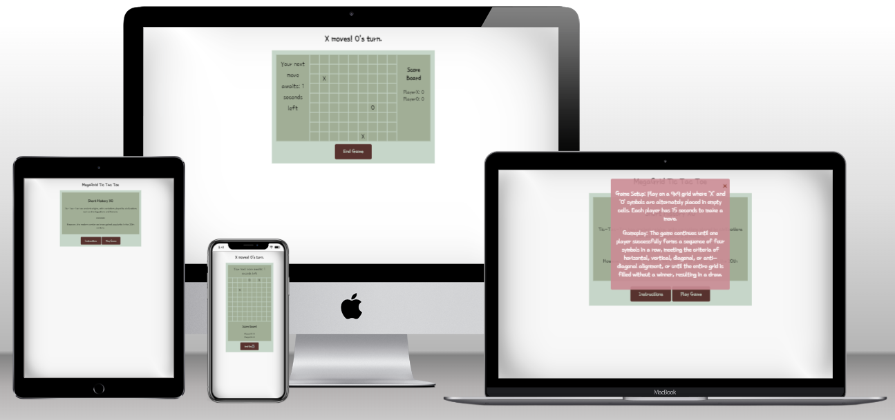

# Megagrid Tic Tac Toe

## Overview

Welcome to an unconventional twist on the classic game of Tic Tac Toe. In this version, players engage in strategic battles on a larger 9x9 grid, offering a fresh and challenging experience. This version provides a challenging yet rewarding experience for players seeking a fresh twist on a familiar game. 

View the live site [here](https://cosmin1907.github.io/tic-tac-toe/)

## User Stories

- **Game Enthusiast**

I was eager to try out Tic Tac Toe on a 9x9 grid, especially with the added challenge of a 15-second time cap per move. The larger board promised deeper strategy, and the time pressure only heightened the excitement. 

- **Amateur Player**

Although I initially hesitated, the clear instructions provided on the game's landing page helped me gain more confidence.
I found myself quickly adapting to the fast-paced gameplay, making decisions on the fly and learning to think more strategically under pressure.

## Features

- **The Grid**

The 9x9 grid is dynamically generated, with its visual representation achieved through HTML elements generated by JavaScript code.

- **Score Board**

The Score Board updates each time a player wins, keeping track of the number of wins until the player chooses to exit the game through the end game button.

- **Move Timer**

At the beginning of the game, a timer initiates a countdown from 15 seconds, providing each player with a limited timeframe to make their move. If a player fails to make a move within the allotted 15 seconds, the computer intervenes, making a random move on their behalf.

- **Player Turn**

This feature begins by informing the players of who will move first and continues to update throughout the game, indicating whose turn it is. It automatically updates after each player has made a move.

- **Info Modals**

Their purpose is to provide information to the player when needed, without disrupting the game. Additionally, the game modal also facilitates resetting the game to its initial state through a replay button.

## Landing Page

The landing page serves a dual purpose: it presents a brief history of the game and provides clear instructions to the player.

- **Main Purpose**

Its primary function is to introduce the player to the game and offer concise guidance on gameplay.

## Game Page

The game page presents a streamlined playing layout, providing the player with clear access to all necessary information such as player turn, scoreboard, and time remaining until the next move. At the conclusion of each round, a winner is declared through a popup, and the player is given the option to play again. 

- **Main Purpose**

Essentially, the primary goal is to offer an immersive playing experience and encourage the player to enjoy multiple games with ease.

## Features Left to Implement

Implement Player vs Computer functionality using the MiniMax algorithm.

## Design

### Wireframes

Landing Page

Game Page

## Testing

### Responsivness

- **Testing Criteria**

Conducted testing on all pages for responsiveness across screen sizes from 320px upwards, following [WCAG 2.1 Reflow criteria for responsive design](https://www.w3.org/WAI/WCAG21/Understanding/reflow.html)
Utilized Chrome, Edge, Firefox browsers.

- **Steps to Test**

Opened the browser and navigated to [Landing Page](https://cosmin1907.github.io/tic-tac-toe/).
Opened developer tools and set to responsive mode.
Decreased width to 320px, set zoom to 50%, and clicked/dragged the responsive window to maximum width.

- **Expected**

Website should be responsive on all screen sizes.

1. No pixelation.
2. No horizontal scroll.
3. No overlapping elements.

- **Actual**

### Accessibility

[Wave Accessibility](https://wave.webaim.org/) tool was used for final testing of the deployed website to check for any aid accessibility testing.

Testing was focused to ensure the following criteria were met:

- Color contrasts meet a minimum ratio as specified in [WCAG 2.1 Contrast Guidelines](https://www.w3.org/WAI/WCAG21/Understanding/contrast-minimum.html)
- Heading levels are not missed or skipped to ensure the importance of content is relayed correctly to the end user
- All content is contained within landmarks to ensure ease of use for assistive technology, allowing the user to navigate by page regions
- All not textual content had alternative text or titles so descriptions are read out to screen readers
- HTML page lang attribute has been set
- Aria properties have been implemented correctly
- WCAG 2.1 Coding best practices being followed

### Functional Testing

| Feature | Expected Outcome | Testing Performed | Result | Pass/Fail |
| ---------------------- | -------------------------------------------------------------------------------- | ---------------------------------------------- | ------------------------------------------------- | --------- |
| **Buttons** | | | | |
| Instructions  | Clicking will open the game instructions modal.                      | Clicked Instructions | Pop up modal openes over the screen  | Pass  |
| Play Game       | Clicking will redirect the user to the Game page  | Clicked Play Game  | Redirected to the Game page.   | Pass |
| End Game | Clicking will redirect the user to the landing page.                   | Clicked End Game | Redirected to the Landing page. | Pass      |
| Replay | Clicking will reset the game grid and restart the counter                   | Clicked Replay | Game reseted and the counter restarted. | Pass      |
| **Timer**  | | | | |
| Countdown from 15s  | Replay button resets countdown; at 0, triggers random move and resets count | Let coundown reach zero, Clicked Replay button.   | Countdown hits zero: random move is made. Replay resets countdown. | Pass  |
| **Score Board** | | | | |
| Score | Win count increments by 1 for each player's win, tracking total wins | Played multiple games to ensure score increments accurately each time. | Score is incremented corectly at the end of each game. | Pass |
| **Player Move** | | | | |
| Player | Automatically announcing player's turn and prompting action after each turn change. | Played multiple games to verify player naming accuracy. | Player name and turn change executed accurately. | Pass |
| **Declare Winner** | | | | |
| Winner Modal | Automatically announcing the winning player and their number of moves.  | Played several games to confirm accurate recognition and reporting of the winning player. | The game accurately detects winning combinations and announces the winning player accordingly. | Pass |

- In addition to manual tests, I conducted 100 random tests using the game's functionality. I set the countdown timer to 1 second and had the computer perform a random move every second until a winning combination was found.

- **Navigation**

Confirmed all navigation links lead to the correct pages.
Verified links on all pages, ensuring expected navigation.

### Validator Testing

- HTML

  - No errors were returned when passing through the official [W3C validator](https://validator.w3.org)

  
  

- CSS

  - No errors were found when passing through the official [(Jigsaw) validator](https://jigsaw.w3.org)

  

### Lighthouse Testing

- **Additional Device Testing**

Aditional testing was performed on the following devices:

1. Ipad Pro
2. iPhone SE

- **Browsers**

I used for testing the following browsers:

1. Google Chrome
2. Mozilla Firefox
3. Microsoft Edge

### Unfixed Bugs

No major bugs were left unfixed. Any minor issues or limitations are detailed here: .........

## Deployment

### Version Control

The site was created using GitPod code editor and pushed to github to the repository ‘tic-tac-toe’.

The following git commands were used throughout development to push code to the remote repo:

`git add <file>` - This command was used to add the file(s) to the staging area before they are committed.

`git commit -m “commit message”` - This command was used to commit changes to the local repository queue ready for the final step.

`git push` - This command was used to push all committed code to the repository on github.

### Deployment to Github Pages

- The site was deployed to GitHub pages. The steps to deploy are as follows:
  - In the GitHub repository, navigate to the Settings tab
  - From the menu on left select 'Pages'
  - From the Build and deployment section, Branch sub section drop-down menu, select: main Click 'Save'
  - A live link will be displayed when published successfully.

The live link can be found here - <https://cosmin1907.github.io/tic-tac-toe/>

### Clone the Repository Code Locally

Navigate to the GitHub Repository you want to clone to use locally:

- Click on the code drop down button
- Click on HTTPS
- Copy the repository link to the clipboard
- Open your IDE of choice (git must be installed for the next steps)
- Type git clone copied-git-url into the IDE terminal

The project will now of been cloned on your local machine for use.

## Credits

I drew inspiration and incorporated code from:

[Kenny Yip Coding](https://youtu.be/4ARsthVnCTg?si=sZ1DGSHS9bwaNIsP)

[freeCodeCamp](https://youtu.be/P2TcQ3h0ipQ?si=j6nRsbbvn8JTbDJV)

[Shecodes](https://www.shecodes.io/athena/52336-how-to-create-a-countdown-timer-in-javascript)

[W3schools](https://www.w3schools.com/howto/howto_css_modals.asp)

[Geeksforgeeks](https://www.geeksforgeeks.org/how-to-select-a-random-element-from-array-in-javascript/)

- **Content**

  - Wikipedia was used for inspiration to write a short game history 

  [Tic-tac-toe Wikipedia](https://en.wikipedia.org/wiki/Tic-tac-toe#:~:text=An%20early%20variation%20of%20tic,empty%20spaces%20to%20keep%20playing.)